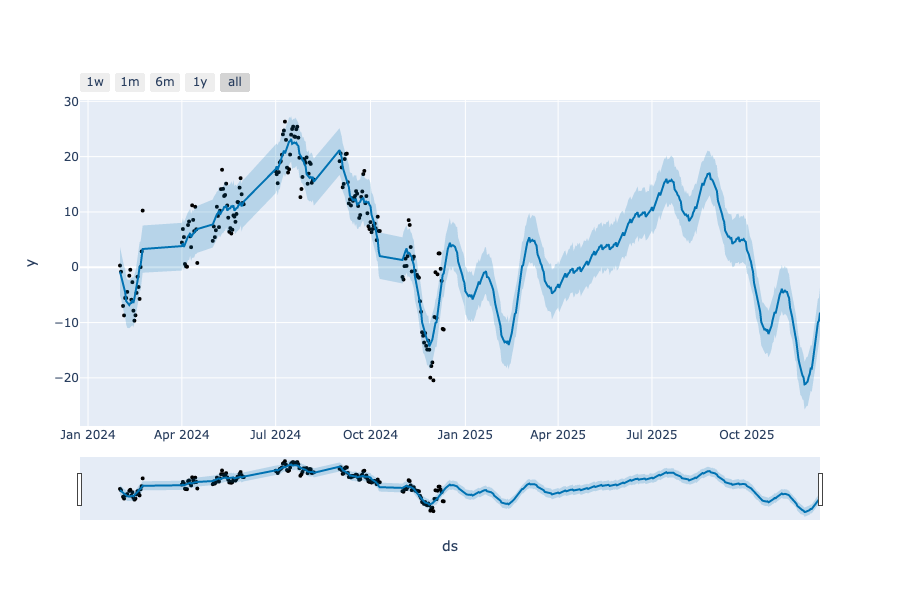
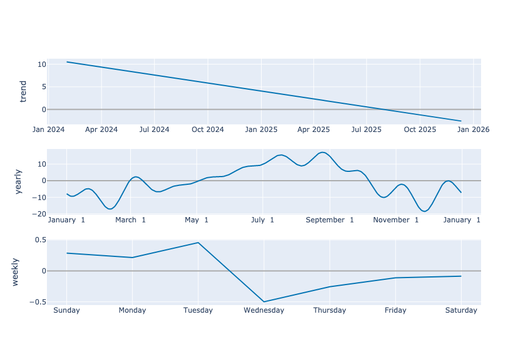

# Edmonton Temperature Predictor

This program uses the Prophet library to forecast daily average temperatures in Edmonton for the year 2025 based on a historical temperature dataset. The data is preprocessed using pandas and the Prophet model is then trained on the daily average temperatures, and predictions are made for the next 365 days. The program generates two visualizations: a forecast plot and a components plot, both saved as HTML and PNG files. These plots help visualize the temperature trends and seasonal components over time.

---

## Forecast Plot



## Components Plot



---

### Dependencies
The following dependencies are required to run the python script.
```
- pandas 
- plotly 
- prophet
- kaleido
```
